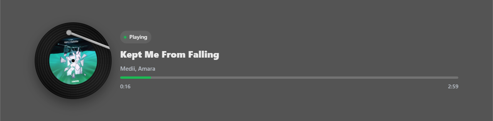
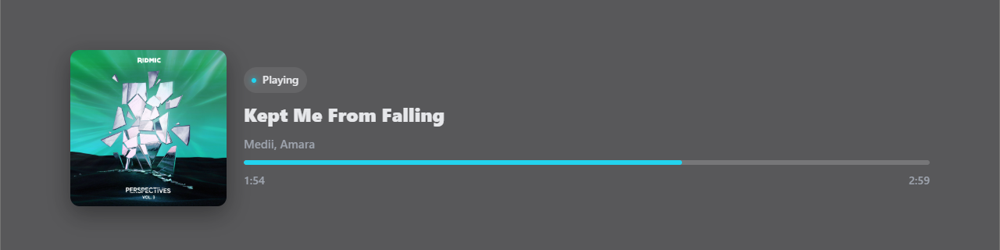
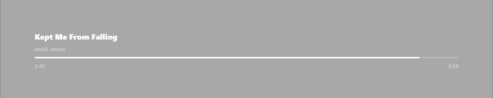

# SpotiStream – Spotify Now Playing Overlay for Streamers

Live “Now Playing” overlay with a **vinyl record** look by default (spinning disc, grooves, center label), plus alternate layouts and themes. 100% client-side OAuth (PKCE) — **no server**, no secrets.

**Hosted overlay:**  
https://kelvinph.github.io/SpotiStream/overlay.html

---

## 🚀 Quick Start

1) **Create a Spotify app** → https://developer.spotify.com/dashboard/applications  
2) App **Settings** → **Redirect URIs** → **Add** (exactly): https://kelvinph.github.io/SpotiStream/overlay.html > Save.  
3) Copy your **Client ID**.  
4) In **OBS** → **Sources** → **+** → **Browser** → URL: https://kelvinph.github.io/SpotiStream/overlay.html > (Use any size; e.g. 900×300. You can resize later.)  
5) Right–click the Browser Source → **Interact** → **Connect to Spotify** → paste your **Client ID** → approve.  
6) Start playing music in Spotify → the overlay updates automatically.

**Tips for OBS**
- Do the first login **inside OBS** (Interact). Tokens are stored in OBS’s browser cache.  
- In Browser Source **Properties**, uncheck:  
- “Refresh browser when scene becomes active”  
- “Shutdown source when not visible”  
- To scale: just resize the Browser Source. Text and spacing are responsive.

---

## 🧱 Layouts

Choose with `?layout=<type>`. Default is `record`.

| Layout   | Description | Example |
|---------|-------------|---------|
| `record` (default) | Vinyl disc with grooves + center label. Optional tonearm. Spins when playing. | `https://kelvinph.github.io/SpotiStream/overlay.html?theme=spotify` |
| `card`   | Classic rectangular album art + text. | `https://kelvinph.github.io/SpotiStream/overlay.html?layout=card&theme=obsdark` |
| `bar`    | Ultra-minimal text strip (no art/disc). Great for compact HUDs. | `https://kelvinph.github.io/SpotiStream/overlay.html?layout=bar&theme=minimal&bar=4` |
| `stacked`| Disc on top, text below. Centered showcase. | `https://kelvinph.github.io/SpotiStream/overlay.html?layout=stacked&theme=oldradio&font=inter` |

**Behavior switches**
- `spin=0` → stop disc spinning  
- `label=static` → keep the **center label upright** while disc spins  
- `compact=1` → tighter spacing (any layout)

---

## 🎨 Themes

Pick with `?theme=<name>`. You can mix with any layout.

- `spotify` – classic green on dark  
- `obsdark` – near-black to match OBS  
- `minimal` – low blur, thin progress bar, white accent  
- `neon` – cool blue glow  
- `oldradio` – sepia/amber vintage  
- `blue` – cool blue accent  
- `red` – bold red  
- `yellow` – warm yellow  
- `slate` – neutral glass

**Copy-paste links**
https://kelvinph.github.io/SpotiStream/overlay.html?theme=spotify
https://kelvinph.github.io/SpotiStream/overlay.html?layout=card&theme=obsdark
https://kelvinph.github.io/SpotiStream/overlay.html?layout=bar&theme=minimal&bar=4
https://kelvinph.github.io/SpotiStream/overlay.html?layout=stacked&theme=oldradio&font=inter

---

## 🔧 Customization (URL Parameters)

Append these to the URL (after `?` and join with `&`).

### Layout & behavior
- `layout=record|card|bar|stacked`  
- `spin=0` – disable spinning  
- `label=static` – keep record label upright  
- `compact=1` – tighter spacing

### Sizing
- `disc=200` – record/cover size in px (alias: `art=200`)  
- `bar=6` – progress bar height in px  
- (The overlay centers itself and clamps width for readability; scale more by resizing the Browser Source.)

### Colors
- `accent=%231db954` – accent color (hex needs `%23` instead of `#`)  
- `panel=rgba(0,0,0,0.55)` – panel background (set `0` alpha for more transparent)  
- `text=%23ffffff` – main text  
- `muted=%23b3b3b3` – secondary text  
- `radius=16` – corner radius in px  
- `blur=8` – glass blur strength  
- `shadow=0` – disable panel shadow

### Fonts (Google Fonts)
- `font=inter|rubik|montserrat|poppins|firasans`  
  Example:  
  `https://kelvinph.github.io/SpotiStream/overlay.html?theme=oldradio&layout=stacked&font=inter`

---

## 🧪 Ready-to-Use Preset Links

- **Default record (Spotify theme):**  
  `https://kelvinph.github.io/SpotiStream/overlay.html?theme=spotify`

- **Record with static label (easier to read art):**  
  `https://kelvinph.github.io/SpotiStream/overlay.html?theme=spotify&label=static`

- **Card layout (OBS dark):**  
  `https://kelvinph.github.io/SpotiStream/overlay.html?layout=card&theme=obsdark`

- **Minimal bar HUD:**  
  `https://kelvinph.github.io/SpotiStream/overlay.html?layout=bar&theme=minimal&bar=4&compact=1`

- **Stacked vintage center:**  
  `https://kelvinph.github.io/SpotiStream/overlay.html?layout=stacked&theme=oldradio&font=inter`

- **Compact record, smaller disc (blue):**  
  `https://kelvinph.github.io/SpotiStream/overlay.html?theme=blue&disc=170&compact=1`

- **Yellow record for warm scenes:**  
  `https://kelvinph.github.io/SpotiStream/overlay.html?theme=yellow&disc=210`

---

## 📸 Screenshots (optional)

Create `screenshots/` and add PNGs, then reference like:

| Preset | Preview |
|---|---|
| Record + Spotify |  |
| Card + OBS Dark |  |
| Bar + Minimal |  |
| Stacked + Old Radio |  |

---

## ❓ Troubleshooting

**It loops or says Redirect error**  
Your Spotify app’s **Redirect URI** must match **exactly**:  
`https://kelvinph.github.io/SpotiStream/overlay.html`

**I logged in on Chrome but OBS asks again**  
OBS’s Browser Source is a separate sandbox. Do the **one-time login inside OBS** (Right-click → Interact). It persists in OBS’s cache.

**Overlay resets when I switch scenes**  
In Browser Source **Properties**, uncheck:  
- “Refresh browser when scene becomes active”  
- “Shutdown source when not visible”

**Nothing shows**  
Make sure Spotify is actively playing on your account. (Premium **not** required.)

---

## 🔒 Privacy

Uses **OAuth PKCE** in the browser. No client secret. Tokens are stored locally in your browser/OBS environment.

